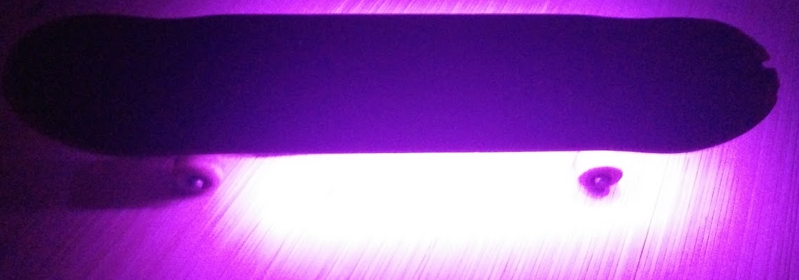

# LIGHT BOARD
---
Light board is my school project for my first year of Applied computer science

During this project we got ultimate freedom to make something using a arduino due and the teachers premade libraries
* bmptk
* hwlib

## Why I chose a skateboard and leds
I Freaking love lights and shiny sparkly blinky things and I also love skateboarding so.    
Lights + skateboarding = lightboarding. 
What did I do to make the project slightly more interesting than just a skateboard with leds.
Well I decided I thought it would be cool to measure to heights of your jumps and maybe make a game out of it to see who can jump the heighest.

## The progress
First I needed to figure out how to use bmptk and hwlib and put a simple blinking led on the due this was very easy and no problem at all.     
Then I needed to figure out how to control a ledstrip ws801 chip I did some googling and found out it's just setting and shifting bits so luckily this went rather easy.     
After writing all the code for the sensor, keeping track of highscores and hooking the code together in one library
The hardest task of all started finding a freaking sturdy casing luckily I had a random large.nl vip box laying around that fitted everthing perfectly <3.
Lacking any kind of metal cutting/drilling tools I used my trusty scissor and screwdrive to make the initial sensor, cable, power, arduino holes. But thank god my friend had a drill that I could use so we easily made some more holes through the skateboard and casing and bolted everything nice and tight.
Then we easily attached the ledstrips and voila the board was done.

## End result

## Haven't tested it with real jumps YET!!!!
